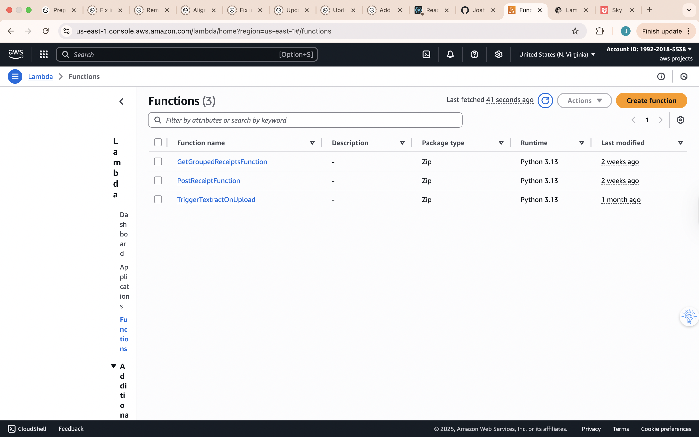
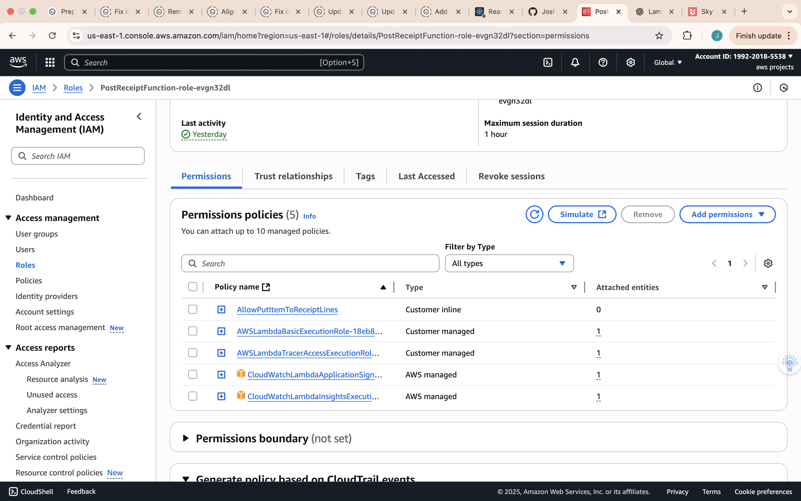
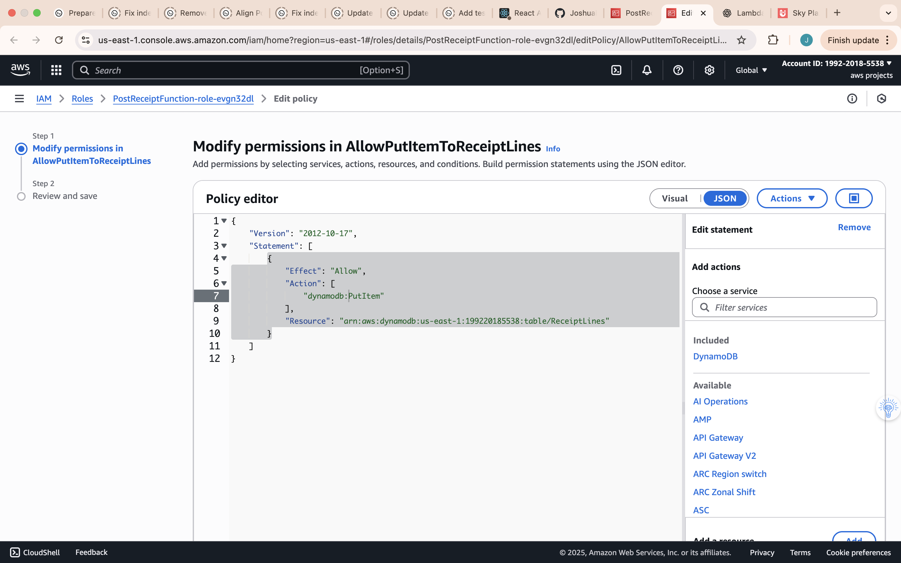
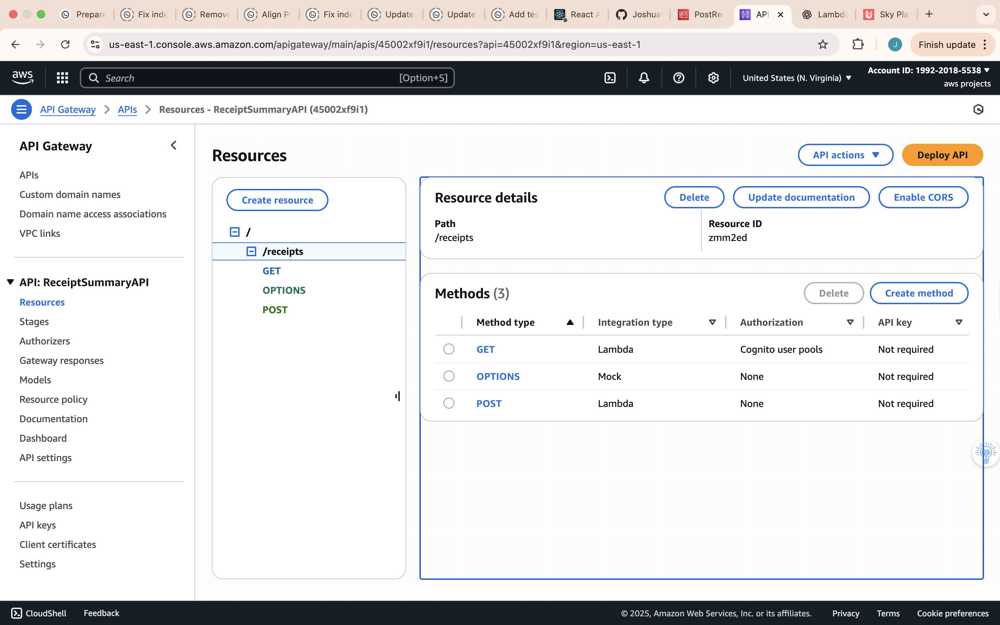
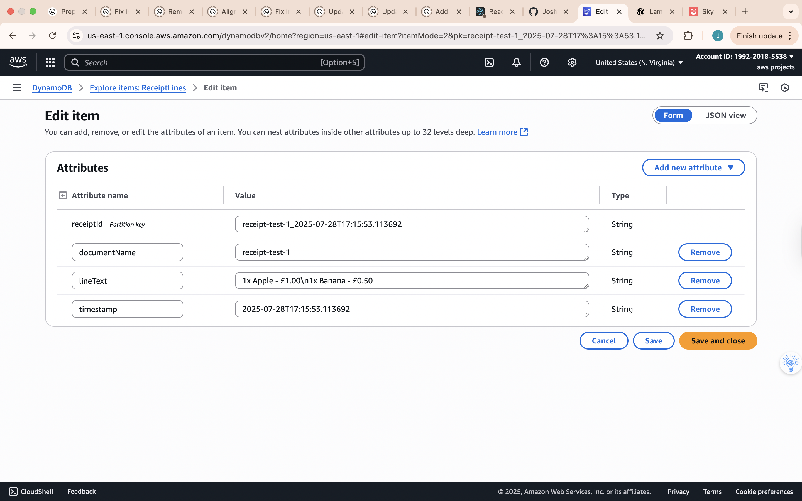
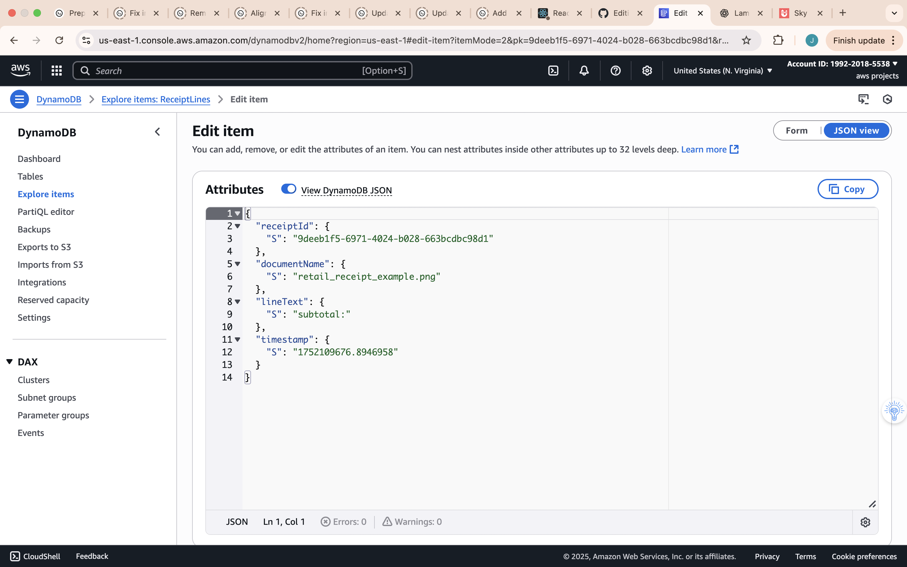

# Backend Architecture Deep Dive

## Backend Architecture Overview

The backend is built using a **serverless architecture on AWS** — primarily **AWS Lambda**, **Amazon API Gateway**, **Amazon Textract**, **Amazon DynamoDB**, and **Amazon OpenSearch Service**.

All infrastructure is defined and deployed via **Terraform**, ensuring consistency across environments and easy reproducibility.

---

## Key AWS Components

- **Amazon API Gateway** — Exposes RESTful API endpoints, integrates directly with Lambda.
- **AWS Lambda** — Executes backend logic for ingestion, retrieval, and search.
- **Amazon Textract** — Performs OCR (AnalyzeExpense API) to extract vendor, date, totals, and line items.
- **Amazon DynamoDB** — Stores structured receipt data.
- **Amazon OpenSearch Service** — Indexes receipt content for full-text search.
- **Amazon S3** *(optional)* — Can store original receipt images.
- **AWS X-Ray** — Traces requests across components.

---

## Lambda Functions and Responsibilities

| Function | Purpose |
|----------|---------|
| **PostReceiptFunction** | Handles `POST /receipt`, calls Textract, stores data in DynamoDB, indexes in OpenSearch. |
| **GetReceiptFunction** | Handles `GET /receipt/{id}`, fetches details from DynamoDB. |
| **SearchReceiptsFunction** | Handles `GET /receipts?query=...`, searches OpenSearch, fetches matching receipts from DynamoDB. |

---
## AWS Lambda – Functions List
Shows all deployed Lambda functions used in the project.  

## Lambda Environment Variables  
Displays the environment variables configured for the PostReceiptFunction.  

## IAM Role Permissions
Shows the Lambda execution role permissions.  

## IAM Policy JSON
Policy document defining allowed actions for the Lambda role.  

## API Gateway Methods
Illustrates the methods configured for API Gateway.  

## DynamoDB Item Form View
Shows DynamoDB item in form mode.  

## DynamoDB Item JSON View
Shows DynamoDB item in JSON mode.  

## Backend Workflow
Receipt Ingestion (POST /receipt)
mermaid
Copy
Edit
sequenceDiagram
    autonumber
    participant Client
    participant APIGW as API Gateway
    participant Lambda as Lambda (PostReceiptFunction)
    participant Textract as Amazon Textract
    participant DynamoDB as Amazon DynamoDB
    participant OpenSearch as Amazon OpenSearch
    
    Client->>APIGW: HTTP POST /receipt (image)
    APIGW->>Lambda: Invoke Lambda
    Lambda->>Textract: AnalyzeExpense
    Textract-->>Lambda: Extracted data
    Lambda->>DynamoDB: Store structured receipt
    Lambda->>OpenSearch: Index for search
    Lambda-->>APIGW: Return success
    APIGW-->>Client: 200 OK
Receipt Search (GET /receipts?query=…)
mermaid
Copy
Edit
sequenceDiagram
    autonumber
    participant Client
    participant APIGW as API Gateway
    participant LambdaSearch as Lambda (SearchReceiptsFunction)
    participant OpenSearch as Amazon OpenSearch
    participant DynamoDB as Amazon DynamoDB
    
    Client->>APIGW: GET /receipts?query=coffee
    APIGW->>LambdaSearch: Invoke Lambda
    LambdaSearch->>OpenSearch: Search index
    OpenSearch-->>LambdaSearch: Matching IDs
    LambdaSearch->>DynamoDB: BatchGetItem
    DynamoDB-->>LambdaSearch: Receipt data
    LambdaSearch-->>APIGW: Return results
    APIGW-->>Client: 200 OK
