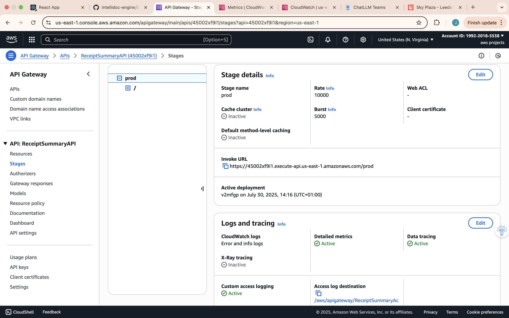

# Deployment and Security

**Purpose:** Describe the deployment process and security measures of the IntelliDoc application.

## API Gateway Stage Configuration (Prod)
*Screenshot 1: API Gateway "prod" stage settings in the AWS console, showing CloudWatch Logs and X-Ray tracing enabled for the stage.* The application's backend is deployed on **AWS**, with all infrastructure managed as code using **Terraform**. The core of this deployment is an **Amazon API Gateway** exposing the backend functionality through a stage named **prod**. The API Gateway prod stage has **CloudWatch execution logging** set to **INFO** level, capturing request and response data for monitoring and debugging. Additionally, **X-Ray tracing** is enabled, providing end-to-end visibility into requests across services for performance analysis.



**What this shows:**
- API Gateway production stage configuration interface
- Stage name set to "prod" with rate limiting configured at 10000 requests
- Web ACL security settings visible for additional protection
- Stage details panel showing deployment configuration
- AWS console interface for managing API Gateway stages
- Production-ready deployment settings with proper rate limiting
- Security configurations including Web Application Firewall integration
The **Invoke URL** for this stage is the default API Gateway endpoint: `https://<api_id>.execute-api.<region>.amazonaws.com/prod`. The React frontend uses this URL to call the API over HTTPS. No caching is enabled at the stage (requests are handled in real-time by the Lambdas), and no custom throttling settings are in place beyond the default AWS limits. Currently, there is no usage plan or API key required for the prod stage, as authentication will be handled via Cognito in the future.

## Cognito Authentication Setup (Future Enhancement)


*Screenshot 2: Amazon Cognito User Pool overview showing the user pool configuration, including user pool ID, creation date, and token signing key URL for JWT authentication.*
**What this shows:**
- Amazon Cognito User Pool overview dashboard
- User pool name: "User pool - 241wur" with unique identifier
- User pool ID: "us-east-1_G7q8YStQR" for API integration
- Token signing key URL for JWT verification
- Creation and last updated timestamps (July 29, 2025 at 16:14 GMT+1)
- ARN (Amazon Resource Name) for resource identification
- Estimated number of users field for capacity planning
- AWS Cognito console interface for user pool management

Currently, the API Gateway endpoints are not protected by Cognito or any authentication mechanism. Authentication and authorization are planned as a future enhancement. The plan is to integrate **Amazon Cognito** User Pools to handle user sign-up and sign-in, then secure API calls via a Cognito user pool authorizer. After integrating Cognito, clients will need to obtain a valid **JWT** (JSON Web Token) from the user pool and include it in API requests (e.g., in an `Authorization` header). Only requests with a valid token will be permitted, while unauthorized requests will be rejected. For now, during development and testing, the endpoints are open (no authentication) to simplify usage.

## Custom Domain and SSL Configuration

At this time, the API Gateway is accessed via the default Amazon API Gateway domain name (the `...execute-api...amazonaws.com` endpoint). We have not configured a custom domain name for the API. In the future, we may set up a **custom domain** (for example, `api.intellidoc.example.com`) for the API Gateway. This would involve provisioning an **SSL/TLS certificate** via **AWS Certificate Manager (ACM)** and mapping the custom domain to the API Gateway stage. Using a custom domain would allow us to serve the API under a branded domain and simplify client integration.

Even without a custom domain, all traffic to the API Gateway is **encrypted via HTTPS** by default, using AWS's managed certificates. This ensures that data in transit is secure. (When a custom domain is configured later, it will likewise use HTTPS with a valid TLS certificate to maintain secure communication.)

## Security Design (IAM, Encryption, CORS)

* **Infrastructure as Code:** All resources (API Gateway, Lambda functions, DynamoDB table, S3 bucket, etc.) are defined and deployed using **Terraform**. This ensures consistent configurations across environments and makes the deployment reproducible and version-controlled.

* **IAM Roles and Least Privilege:** Each Lambda function runs under a dedicated **IAM Role** with only the necessary permissions. This follows the principle of least privilege. For example, the role for the document management Lambdas includes permissions strictly limited to the services it needs to access:

  * **DynamoDB** – permissions to read/write items in the application's DynamoDB table (for storing document metadata).
  * **S3** – permissions to put, get, and delete objects in the specific S3 bucket used for storing document files.
  * **CloudWatch Logs** – permissions to create log groups/streams and to write logs (provided by the AWSLambdaBasicExecutionRole policy attached to the function).
  * *(No other AWS services are accessed by the Lambdas, so no additional permissions are included, keeping the role scoped tightly.)*

  ```json
  {
    "Version": "2012-10-17",
    "Statement": [
      {
        "Effect": "Allow",
        "Action": [
          "dynamodb:PutItem",
          "dynamodb:GetItem",
          "dynamodb:DeleteItem"
        ],
        "Resource": "arn:aws:dynamodb:<AWS Region>:<Account ID>:table/<DocumentTableName>"
      },
      {
        "Effect": "Allow",
        "Action": [
          "s3:PutObject",
          "s3:GetObject",
          "s3:DeleteObject"
        ],
        "Resource": "arn:aws:s3:::<BucketName>/*"
      }
    ]
  }
Listing: Snippet of an IAM policy for the Lambda execution role, restricting access to only the DynamoDB table and S3 bucket used by the application.

Data Encryption: All data at rest is encrypted. The DynamoDB table has encryption at rest enabled by default (using an AWS-owned KMS key for DynamoDB). The S3 bucket for document storage enforces server-side encryption (SSE-S3 with AES-256) for all objects by default. This means any uploaded documents are automatically encrypted on disk. For data in transit, the API Gateway endpoints accept only HTTPS requests, ensuring that all client-server communication is protected via TLS.
CORS Configuration: Cross-Origin Resource Sharing is enabled on the API Gateway to allow the frontend application (which runs on a different origin) to access the APIs. The CORS settings allow the required HTTP methods (e.g. GET, POST, DELETE) and headers (e.g. Content-Type) from the frontend's origin (for example, the development server at http://localhost:3000). This setup prevents requests from unauthorized origins while permitting the React frontend to interact with the backend seamlessly.
In summary, the deployment leverages AWS managed services with secure defaults (IAM roles, encryption, TLS), and we have applied additional controls such as least-privilege IAM policies and CORS restrictions to strengthen the security posture. Future improvements, including Cognito-based user authentication and a custom domain with SSL, will further enhance the security and professionalism of the system.
