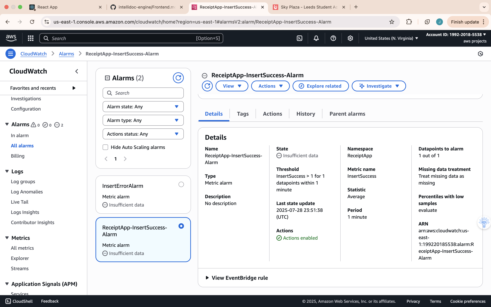

# Monitoring and Logging

**Purpose:** This section demonstrates the system’s observability through comprehensive logging, custom metrics, automated alarms, and distributed tracing. By leveraging Amazon CloudWatch and AWS X-Ray, we can monitor application health in real time and quickly pinpoint any issues. The following subsections provide evidence of these capabilities (logs, metrics, alarms, and traces) and explain their operational benefits.

---

## CloudWatch Logs Insights Query Example & Results

# Figure 1: Query results showing successful insert log events.*
In our system, all key operations (such as inserting a record into the database) are logged. The screenshot above shows a CloudWatch Logs Insights query that filters the Lambda function’s logs for the phrase **“Inserted successfully”**, which is logged upon a successful insert. The query results confirm that insert operations are completing as expected, with timestamps and log messages indicating success events.

Using **CloudWatch Logs Insights**, engineers can quickly search and analyze log data to **diagnose problems** and **verify system behavior**. If a data ingestion fails or an anomaly occurs, targeted log queries help find the root cause in seconds.

---

## Custom CloudWatch Metrics (InsertSuccess & InsertError)

# Figure 2: Custom CloudWatch metrics tracking successful vs. failed inserts.*
This figure shows two custom metrics emitted by the Lambda function at runtime: 
InsertSuccess (successful DynamoDB writes) 
InsertError (failed attempts).
These metrics provide deeper visibility beyond default AWS metrics, allowing engineers to spot spikes in errors, track throughput trends, and detect sudden anomalies in the system’s data ingestion pipeline.

---

## CloudWatch Alarms (Thresholds & Descriptions)

  
# Figure 3: Alarm for any insert failure (≥ 1 error in 5 min).*

# Figure 4: Alarm for pipeline inactivity (no successes in 15 min).*

# Figure 5: Dashboard view of all active alarms.*

We created **InsertErrorAlarm** and **InsertSuccessAlarm** with thresholds designed to detect:  
- **Any failure** – Triggers if ≥ 1 error in 5 minutes.  
- **Pipeline stalls** – Triggers if 0 successes in 15 minutes.  

These alarms send Amazon SNS notifications to our Ops channels for immediate action. This proactive setup ensures we catch issues before they cause major disruption.

---

## AWS X-Ray Tracing (Traces List & Service Map)

# Figure 6: List of recent request traces.*

 
# 7: Visual architecture and health overview.*

We enabled **AWS X-Ray** for Lambda and downstream services to capture distributed traces.  
- **Traces list** – Shows per-request latency, status, and detailed execution timeline.  
- **Service map** – Displays real-time architecture with health indicators for each component.

X-Ray helps identify slow components, pinpoint failures, and validate that all services are interacting as expected.

---

## Operational Benefits of Observability

Implementing logging, metrics, alarms, and tracing delivers:

- **Fast Issue Detection** – Immediate SNS alerts for anomalies.  
- **Efficient Troubleshooting** – Targeted log queries and trace analysis.  
- **Quantitative Monitoring** – Track throughput and error rates over time.  
- **Holistic Visibility** – Real-time architecture health via X-Ray service map.  
- **Improved Reliability** – Reduced downtime and faster MTTR.

